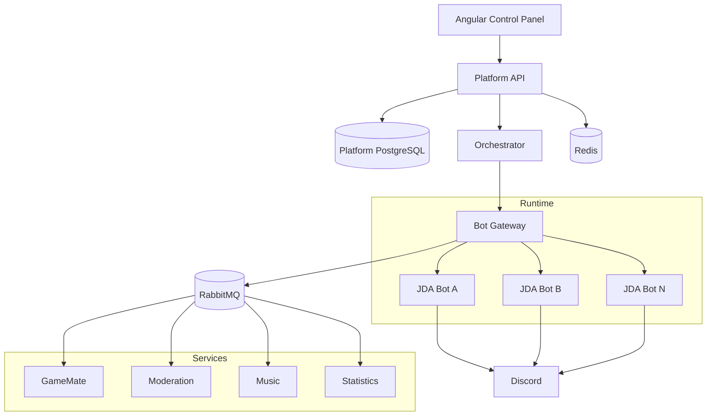
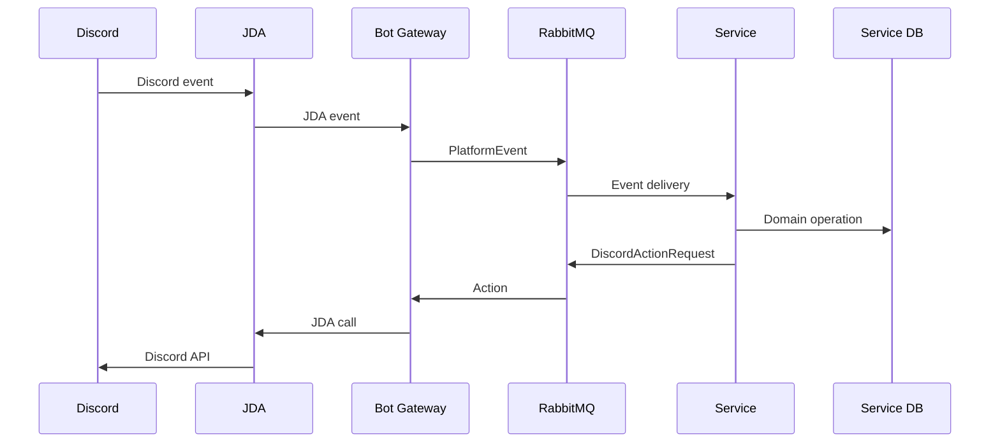
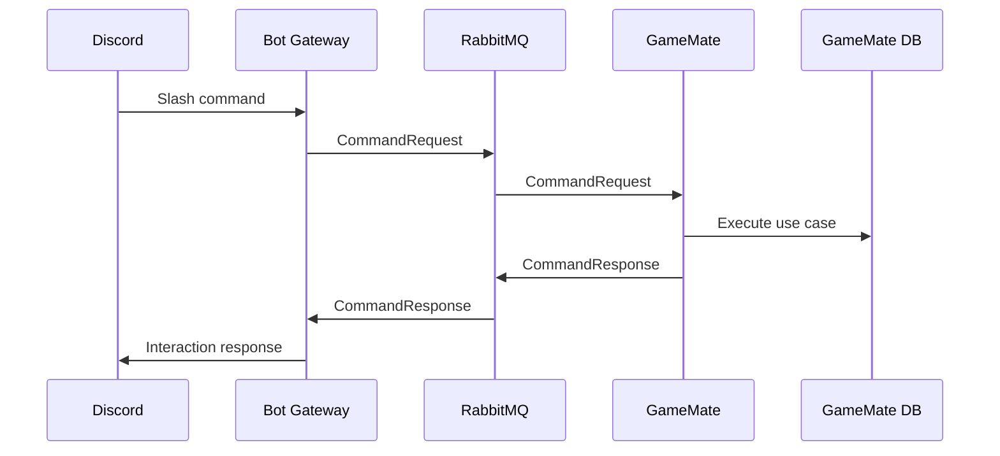
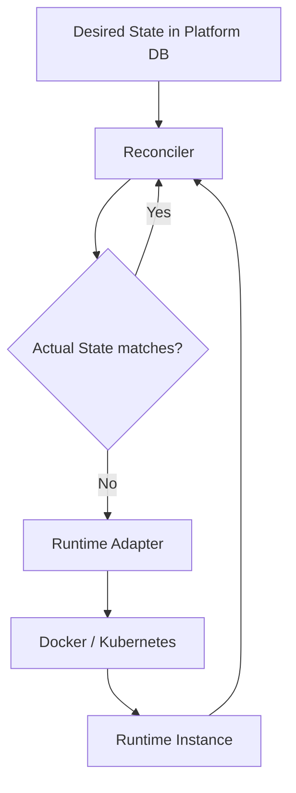
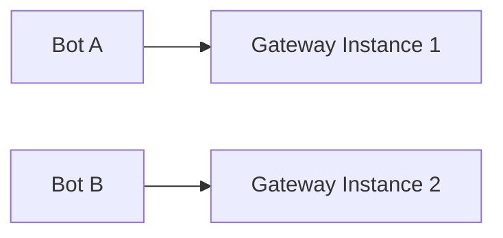
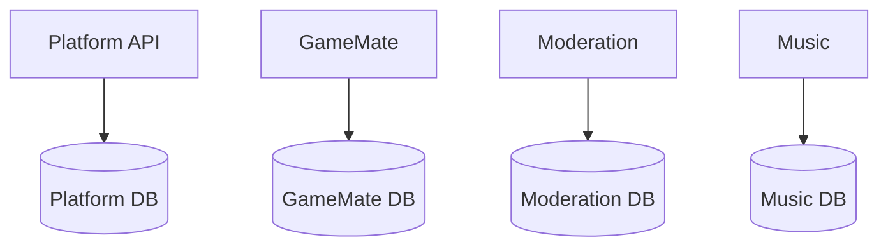

# Architecture Diagrams

All diagrams use Mermaid.

## Overall architecture

## Discord event flow

## Command flow

## Desired-state reconciliation

## Bot ownership

The ownership mapping must prevent two active gateway instances from opening the same bot connection unless the Discord/JDA sharding model explicitly allows it.

## Data ownership

